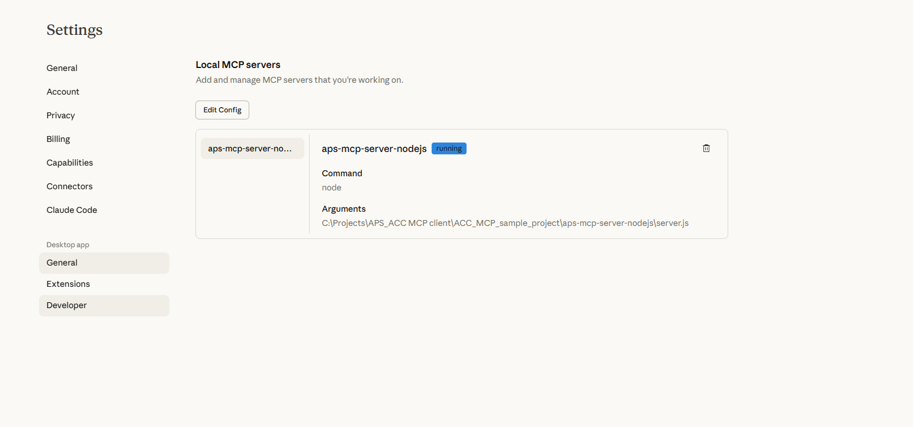

# aps-mcp-server-nodejs

Simple [Model Context Protocol](https://modelcontextprotocol.io) server built with Node.js, providing access to [Autodesk Platform Services](https://aps.autodesk.com) API, with fine-grained access control using [Secure Service Accounts](https://aps.autodesk.com/en/docs/ssa/v1/developers_guide/overview/).


[YouTube Video](https://youtu.be/6DRSR9HlIds)

## Overview

This MCP server enables AI assistants (like GitHub Copilot, Claude, and Cursor) to interact with your Autodesk Construction Cloud (ACC) projects through natural language. By connecting AI chat interfaces to APS APIs, you can query project data, browse files, and analyze issues without leaving your development environment.

### How It Works

The Model Context Protocol (MCP) creates a standardized way for AI assistants to access external data sources:

```
┌─────────────────┐         ┌──────────────────┐         ┌─────────────────┐
│   VS Code +     │  MCP    │  aps-mcp-server  │   APS   │  Autodesk ACC   │
│ GitHub Copilot  │ ◄─────► │   (Node.js)      │ ◄─────► │   Projects      │
└─────────────────┘  stdio  └──────────────────┘   API   └─────────────────┘
```

1. **AI Client** (VS Code/Claude/Cursor) sends natural language queries
2. **MCP Server** translates queries into APS API calls using Secure Service Account credentials
3. **APS APIs** fetch data from your ACC projects
4. **MCP Server** returns structured data to the AI client
5. **AI Client** formats and presents the information to you

### Available MCP Tools

This server provides 4 tools that AI assistants can use:

| Tool | Description | Parameters | Returns |
|------|-------------|------------|---------|
| **getProjectsTool** | Retrieves all ACC accounts and projects accessible to your service account | None | List of accounts with nested projects (IDs and names) |
| **getFolderContentsTool** | Browses folder and file structure within a project | `accountId`, `projectId`, `folderId` (optional) | List of folders and files with IDs and display names |
| **getIssuesTool** | Fetches all issues from a project | `projectId` | List of issues with IDs, titles, statuses, types, assignments, due dates, and 3D coordinates |
| **getIssueTypesTool** | Gets available issue types and subtypes | `projectId` | List of issue types with subtypes (for issue classification) |

### VS Code MCP Client Integration

When you use this server with **VS Code + GitHub Copilot**:

1. **Configuration**: The `.vscode/mcp.json` file tells VS Code where to find the MCP server
2. **Connection**: VS Code starts the Node.js server and connects via stdio (standard input/output)
3. **Authentication**: The server uses Secure Service Account credentials from `.env` for API access
4. **Tool Discovery**: Copilot learns what tools are available from the server
5. **Natural Queries**: You ask questions in Copilot Chat using plain English
6. **Tool Execution**: Copilot decides which tools to call and with what parameters
7. **Response**: Results are formatted and displayed in the chat interface

**Example interaction:**
```
You: "What projects do I have access to?"
Copilot: [calls getProjectsTool] → "You have 1 project: Construction: Sample Project..."

You: "List all issues"
Copilot: [calls getIssuesTool with projectId] → "You have 2 open issues..."
```

### Comparison with ACC Native Features

| Feature | ACC Web Interface | ACC Project Beta | APS MCP Server |
|---------|-------------------|------------------|----------------|
| **Access Method** | Web browser | Web browser | AI chat in IDE |
| **Query Interface** | GUI navigation | Conversational AI | Conversational AI |
| **Integration** | Standalone app | Standalone app | Embedded in VS Code/Claude/Cursor |
| **Authentication** | User login | User login | Service Account (programmatic) |
| **Data Access** | Full ACC features | Limited to conversation context | API-based (read access) |
| **Customization** | Fixed UI | Fixed AI behavior | Custom tools & scripts |
| **Use Case** | Manual project management | Quick queries & assistance | Developer workflows & automation |
| **Multi-Project** | Switch between projects | Context limited | Access all authorized projects |
| **Offline Mode** | ❌ No | ❌ No | ❌ No (requires API) |
| **File Upload** | ✅ Yes | ✅ Yes | ❌ No (read-only) |
| **Issue Creation** | ✅ Yes | ✅ Yes | ❌ No (not implemented yet) |
| **Real-time Collaboration** | ✅ Yes | Limited | ❌ No |

**Key Differences:**

- **ACC Project Beta**: Autodesk's native AI assistant integrated into the ACC web interface, designed for project managers and teams working directly in ACC
- **APS MCP Server**: Developer-focused tool that brings ACC data into your coding environment, ideal for:
  - Building automation scripts
  - Creating custom reports
  - Integrating ACC data with other systems
  - Quick project status checks without leaving your IDE
  - Prototyping new ACC integrations

**When to use each:**
- Use **ACC Web Interface** for full project management, file uploads, and team collaboration
- Use **ACC Project Beta** for quick questions while working in ACC web
- Use **APS MCP Server** for development workflows, custom automation, and IDE-native queries

## Customer Value & Use Cases

### 🎯 Value Proposition

The APS MCP Server bridges the gap between construction data and AI-powered development tools, enabling customers to:

1. **Reduce Context Switching** - Access ACC data without leaving your IDE
2. **Accelerate Development** - Build integrations faster with AI assistance
3. **Improve Data Visibility** - Query project data conversationally in natural language
4. **Enable Automation** - Foundation for building custom workflows and scripts
5. **Prototype Rapidly** - Test API integrations before full implementation

### 👥 Target Customer Segments

#### 1. **Construction Technology Teams**
Organizations building custom integrations on top of ACC:
- **Pain Point**: Manual API exploration and testing is time-consuming
- **Solution**: Query ACC data conversationally while writing integration code
- **Example**: "Show me the issue schema for this project" while building an issue tracking integration

#### 2. **BIM/VDC Developers**
Developers creating automation for construction workflows:
- **Pain Point**: Need to understand project structure before writing automation scripts
- **Solution**: Explore project data, folder structures, and issue patterns without leaving the code editor
- **Example**: "List all RVT files and their locations" while building a model coordination script

#### 3. **System Integrators**
Teams connecting ACC with other enterprise systems (ERP, PM tools):
- **Pain Point**: Understanding data models and testing connections across multiple systems
- **Solution**: Quick data validation and testing during integration development
- **Example**: "What fields are available in issues?" while mapping data between systems

#### 4. **DevOps/Infrastructure Teams**
Teams managing APS applications and monitoring project health:
- **Pain Point**: Need quick insights without building full dashboards
- **Solution**: Ad-hoc queries for monitoring and troubleshooting
- **Example**: "How many open issues are in production projects?" for health checks

#### 5. **Independent Developers/Consultants**
Freelancers building APS solutions:
- **Pain Point**: Limited time for API exploration and testing
- **Solution**: Rapid prototyping and validation of ideas
- **Example**: Test API responses before committing to implementation approach

### 💼 Real-World Use Cases

#### Use Case 1: **Rapid Integration Development**
**Scenario**: Developer building a custom dashboard that displays project issues

**Traditional Workflow**:
1. Open browser → Navigate to APS API docs
2. Set up Postman/Insomnia for API testing
3. Configure authentication
4. Test API endpoints manually
5. Copy response structure
6. Switch back to IDE
7. Write code based on manual testing

**With MCP Server**:
1. In VS Code: "Show me all issues in my project"
2. Review data structure in chat
3. Ask: "What fields are available for filtering?"
4. Immediately start writing code with accurate data models
5. **Time saved**: 30-60 minutes per API endpoint

#### Use Case 2: **Project Health Monitoring**
**Scenario**: DevOps team needs to check project status across multiple sites

**Query Examples**:
```
"How many projects do I have access to?"
"List all open issues across projects"
"Show me projects with issues overdue by more than 7 days"
"What are the most common issue types?"
```

**Value**: Quick health checks without building custom reporting tools

#### Use Case 3: **Debugging Production Issues**
**Scenario**: Support team investigating customer-reported problems

**Workflow**:
```
Developer: "What issue types are available in project X?"
Copilot: [Returns actual issue types from customer's project]

Developer: "Show me all issues created in the last 24 hours"
Copilot: [Returns recent issues with details]

Developer: "What's the folder structure of this project?"
Copilot: [Shows actual folder hierarchy]
```

**Value**: Faster troubleshooting with real-time data access

#### Use Case 4: **Data Migration Planning**
**Scenario**: Migrating data from legacy system to ACC

**Queries**:
```
"Show me the folder structure of all projects"
"What custom fields are configured for issues?"
"List all file types in the project"
```

**Value**: Understand target system structure before migration scripting

#### Use Case 5: **Training & Documentation**
**Scenario**: Training new developers on APS APIs

**Interactive Learning**:
```
Trainee: "What data can I get from an issue?"
Copilot: [Shows real issue structure with actual data]

Trainee: "How are folders organized?"
Copilot: [Demonstrates with live project data]
```

**Value**: Learn with real examples instead of abstract documentation

### 🔄 Customer Workflow Examples

#### For Construction Tech Companies:

```
Morning Standup:
PM: "What's blocking us today?"
Dev: [Opens VS Code] "Show me all high-priority issues"
Result: Team sees real blockers in 5 seconds

During Development:
Dev: "List all .dwg files in the structural folder"
Copilot: [Returns file list]
Dev: Uses list to build file processing automation

Before Deployment:
Dev: "How many projects will this affect?"
Copilot: [Lists all accessible projects]
Dev: Plans rollout strategy
```

#### For System Integrators:

```
Discovery Phase:
"What issue types exist?" → Map to target system
"Show me all custom attributes" → Plan data transformation
"List all projects by region" → Scope integration effort

Development Phase:
"Get sample issue data" → Test transformation logic
"What's the folder structure?" → Plan file sync strategy
"Show project metadata" → Validate connection

Testing Phase:
"Create test issue" (future feature) → Validate round-trip
"List recent changes" → Verify sync accuracy
```

### 📊 ROI & Metrics

**Time Savings**:
- API exploration: 30-60 min → 2-5 min (90% reduction)
- Data structure discovery: 45 min → 5 min (89% reduction)
- Integration prototyping: 4 hours → 1 hour (75% reduction)

**Productivity Gains**:
- Developers stay in IDE: 80% less context switching
- Faster debugging: Real-time data access vs manual API calls
- Reduced errors: AI-assisted queries vs manual Postman testing

**Business Impact**:
- Faster time-to-market for integrations
- Lower training costs for new developers
- Improved developer experience and satisfaction
- Enables rapid prototyping and innovation

### 🚀 Future Expansion Opportunities

**Planned Enhancements** (not yet implemented):
1. **Write Operations**: Create/update issues, upload files
2. **Advanced Queries**: Filter, sort, aggregate data
3. **Multi-Project Operations**: Bulk queries across projects
4. **Webhooks Integration**: Real-time notifications in IDE
5. **Cost Management**: Query budget and cost data
6. **Schedule Data**: Access project timelines and milestones
7. **RFI Management**: Query and manage RFIs
8. **Document Management**: Search and analyze documents

**Extended Use Cases**:
- Automated issue creation from code comments
- Project health dashboards in IDE
- Compliance checking and reporting
- Automated status updates to stakeholders
- Integration testing frameworks

### 🎓 Getting Started for Customers

**For Construction Tech Teams**:
1. Set up Secure Service Account (15 min)
2. Configure MCP server in VS Code (5 min)
3. Start querying your projects (immediate)
4. Build on top with custom tools (ongoing)

**For Consultants/Freelancers**:
1. Use for rapid prototyping (Day 1)
2. Validate customer requirements (Day 2-3)
3. Build production integrations (Week 1+)
4. Deliver faster, more accurate solutions

**For Enterprise Teams**:
1. Pilot with 2-3 developers (Week 1)
2. Measure time savings and productivity (Week 2-4)
3. Roll out to entire team (Month 2)
4. Expand with custom tools (Ongoing)

### 💡 Success Stories (Potential)

**Example 1: BIM Coordination Company**
- **Before**: 4 hours to explore API and build issue reporter
- **After**: 1 hour with MCP-assisted development
- **Result**: 75% time reduction, faster client delivery

**Example 2: Construction Software Vendor**
- **Before**: Support team manually checked API responses
- **After**: Instant troubleshooting with natural language queries
- **Result**: 60% faster issue resolution

**Example 3: Enterprise General Contractor**
- **Before**: Developers built custom API testing tools
- **After**: Used MCP server for all API exploration
- **Result**: Eliminated 20 hours/month of tool maintenance

## Development

### Prerequisites

- [Node.js](https://nodejs.org)
- [APS application](https://aps.autodesk.com/en/docs/oauth/v2/tutorials/create-app) (must be of type _Server-to-Server_)
- [Provisioned access to ACC](https://get-started.aps.autodesk.com/#provision-access-in-other-products)

### Setup

#### Secure Service Account

Our MCP server will need a secure service account and a private key. Instead of implementing the logic in this code sample, we will use https://ssa-manager.autodesk.io:

- Go to https://ssa-manager.autodesk.io, and log in with your APS client ID and secret
- Create a new secure service account using the _Create Account With Name:_ button; don't forget to specify the first name and last name
- Make sure the new account is selected in the _Accounts_ list
- Make note of the `serviceAccountId` and `email` values under _Account Details_
- Create a new private key using the _Create Key_ button; a _*.pem_ file will be automatically downloaded to your machine
- Make sure the new private key is selected in the _Keys_ list
- Make note of the `kid` value under _Key Details_

#### Autodesk Construction Cloud

- Make sure you've provisioned access to ACC for your APS application
- Invite the secure service account (the `email` value from earlier) as a new member to your selected ACC projects

#### Server

- Clone this repository
- Install dependencies: `yarn install`
- Create a _.env_ file in the root folder of this project, and define the following environment variables:
  - `APS_CLIENT_ID` - your APS application client ID
  - `APS_CLIENT_SECRET` - your APS application client secret
  - `SSA_ID` -  your service account ID (the `serviceAccountId` field from earlier)
  - `SSA_KEY_ID` - your private key ID (the `kid` field from earlier)
  - `SSA_KEY_PATH` - full path to your downloaded *.pem file
- The _.env_ file might look something like this:

```bash
APS_CLIENT_ID="AhH9..."
APS_CLIENT_SECRET="1FS4..."
SSA_ID="ZCU2TJH5PK8A5KQ9"
SSA_KEY_ID="8a4ee790-3378-44f3-bbab-5acb35ec35ce"
SSA_KEY_PATH="/Users/brozp/aps-mcp-server-nodejs/8a4ee790-3378-44f3-bbab-5acb35ec35ce.pem"
```

## Usage

### MCP Inspector

- Run the [Model Context Protocol Inspector](https://modelcontextprotocol.io/docs/tools/inspector): `npx @modelcontextprotocol/inspector`
- Hit `Connect` to connect to the MCP server

### Claude Desktop

- Make sure you have [Claude Desktop](https://claude.ai/download) installed
- Create a Claude Desktop config file if you don't have one yet:
  - On macOS: _~/Library/Application Support/Claude/claude\_desktop\_config.json_
  - On Windows: _%APPDATA%\Claude\claude\_desktop\_config.json_
- Add this MCP server to the config, using the absolute path of the _server.js_ file on your system, for example:

```json
{
    "mcpServers": {
        "aps-mcp-server-nodejs": {
            "command": "node",
            "args": [
                "/path/to/aps-mcp-server-nodejs/server.js"
            ]
        }
    }
}
```

- Restart Claude Desktop and verify the server is running in **Settings** → **Developer**:



- Open Claude Desktop, and try some of the following test prompts:
  - What ACC projects do I have access to?
  - Give me a visual dashboard of all issues in project XYZ
  - List all issues in my project
  - Show me the folder structure

**Example: Visual Dashboard Generation**

Claude can create interactive visualizations and dashboards from your ACC data:


The MCP server enables Claude to:
- Query real-time project data from ACC
- Generate visual dashboards with issue statistics
- Create charts showing issues by type, status, and more
- Provide detailed project insights through natural conversation

> For more details on how to add MCP servers to Claude Desktop, see the [official documentation](https://modelcontextprotocol.io/quickstart/user).

### Visual Studio Code & GitHub Copilot

- Make sure you have [enabled MCP servers in Visual Studio Code](https://code.visualstudio.com/docs/copilot/chat/mcp-servers#_enable-mcp-support-in-vs-code)
- Create _.vscode/mcp.json_ file in your workspace, and add the following JSON to it:

```json
{
    "servers": {
        "aps-mcp-server-nodejs": {
            "type": "stdio",
            "command": "node",
            "args": [
                "/path/to/aps-mcp-server-nodejs/server.js"
            ]
        }
    }
}
```

> For more details on how to add MCP servers to Visual Studio Code, see the [documentation](https://code.visualstudio.com/docs/copilot/chat/mcp-servers)

### Cursor

- Create _.cursor/mcp.json_ file in your workspace, and add the following JSON to it:

```json
{
  "mcpServers": {
    "aps-mcp-server-nodejs": {
      "command": "node",
      "args": [
        "/path/to/aps-mcp-server-nodejs/server.js"
      ]
    }
  }
}
```

> For more details on how to add MCP servers to Cursor, see the [documentation](https://docs.cursor.com/context/model-context-protocol)
